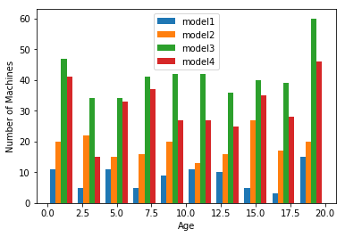
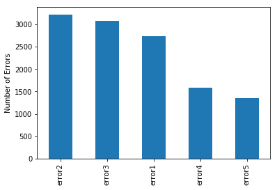
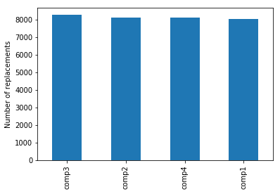
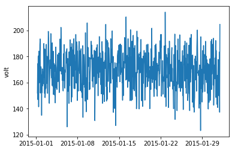
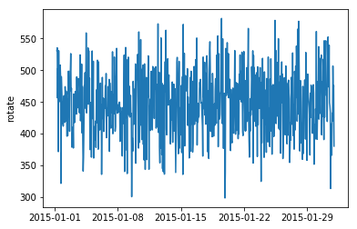
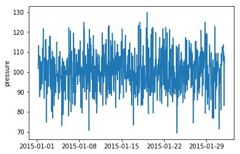
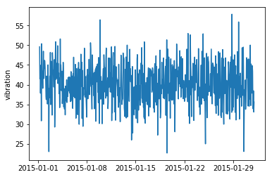
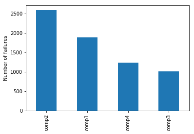
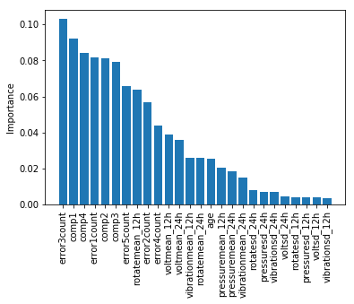
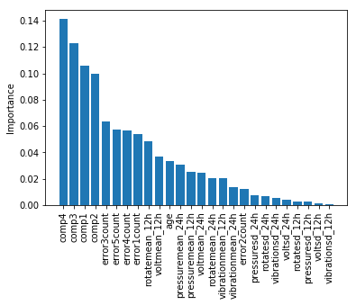

# Finding balance between corrective and preventative maintenance using predictive maintenance

### Authors: Anant Jain, Viral Patel

# Dataset Information:

Dataset for our project can be summarised as follows:

* Machine features: Lifecycle data of machine categorised by model type and age of a machine
* Telemetry data: Operational data collected for various parameters such as voltage, rotation speed, pressure and vibrations using their respective sensors.
* Maintenance Data: Machine's repair history which is documented as regular maintenance checks or replacement of different components.
* Failure Data: Component's failure history and their time of replacement.

Here we should take into account of a fact that failure data may be contained in maintenance data which can be in the form of parts replacement log or special error codes. So, in such cases we can extract the failure data from the maintenance data. It may be possible that there may be some correlation of some other variables with failure history which can help us identify a pattern of instances of failures. This type of correlation is hugely dependent on respective business domains.

Example of similar cases where this type of data is used for prediction :
    
**Machine conditions and usage:** Cruise ship scheduling data, sensor data collected from turbine engines of aircrafts, elevators condition data, ATM operational data, Train's condition data, Car's engine data.
    
**Machine features:** Technical specification of each machine. e.g. In case of Car's data we need the build date,age,usage data of the type of engine. 

**Failure history:** In case of cruise ship, we need data such as arrival delay, departure delay, component failure history.In In case of wind turbine we need data such as gearbox failures, blade failures, Motor failures.

**Maintenance history:** In case of CNC machine headstock, tailstock, chuck and tool maintenance logs also PLC circuit maintenance logs can help in determining rate of replacements of components.

We consider two main type of data types in case of predictive maintenance which is static data type and temporal data type. Telemetry data, Maintenance data and Failure data can be considered as time series data since they are designated with the time when data is collected. This data can be collected from a range of sources which can be either manual data entry or  using observational sensors. On the other hand Machine features and their technical specifications is of type static since it doesn't change after being recorded.

# Step 1:  Data Ingestion and Exploratory Analysis

## Imports


```python
import numpy as np
import pandas as pd 
from matplotlib import pyplot as plt
```

### Machines Dataset:

This dataset contains data about Machine Specification by model type and age of 1000 machines. 

It includes data about each machine's Machine ID, model type and age. 


```python
machines = pd.read_csv('machines.csv', encoding='utf-8') 
machines.head()
```


```python
machines.describe()
```

The following figure plots a histogram of the machines age colored by respective model type.


```python
plt.hist([machines.loc[machines['model'] == 'model1', 'age'],
                       machines.loc[machines['model'] == 'model2', 'age'],
                       machines.loc[machines['model'] == 'model3', 'age'],
                       machines.loc[machines['model'] == 'model4', 'age']],
                       label=['model1', 'model2', 'model3', 'model4'])
plt.xlabel('Age')
plt.ylabel('Number of Machines')
plt.legend()
plt.show()
```

    C:\ProgramData\Anaconda3\lib\site-packages\numpy\core\fromnumeric.py:57: FutureWarning: reshape is deprecated and will raise in a subsequent release. Please use .values.reshape(...) instead
      return getattr(obj, method)(*args, **kwds)
    





This figure shows lifecycle of each machine. The machine age is a important feature for analysis because various errors and failures of machines largely depend on it. We can see that for all age intervals the number of machines are always highest for model 3 followed by model 4, model 2 and model 1.


### Errors  Dataset:

The errors log contains list of errors which occured during operational state of machine which can also be stated as non breaking erros. Even though these errors can't be directly considered as failure reports but considering these error logs can highly help in our analysis since many errors can give us clear prediction about future failures. Here the datetime data is stored and rounded as an hourly rate.


```python
errors = pd.read_csv('errors.csv', encoding='utf-8')
errors.head()
```


<div>
<style>
    .dataframe thead tr:only-child th {
        text-align: right;
    }

    .dataframe thead th {
        text-align: left;
    }

    .dataframe tbody tr th {
        vertical-align: top;
    }
</style>
<table border="1" class="dataframe">
  <thead>
    <tr style="text-align: right;">
      <th></th>
      <th>datetime</th>
      <th>machineID</th>
      <th>errorID</th>
    </tr>
  </thead>
  <tbody>
    <tr>
      <th>0</th>
      <td>2015-01-06 03:00:00</td>
      <td>1</td>
      <td>error3</td>
    </tr>
    <tr>
      <th>1</th>
      <td>2015-02-03 06:00:00</td>
      <td>1</td>
      <td>error4</td>
    </tr>
    <tr>
      <th>2</th>
      <td>2015-02-21 11:00:00</td>
      <td>1</td>
      <td>error1</td>
    </tr>
    <tr>
      <th>3</th>
      <td>2015-02-21 16:00:00</td>
      <td>1</td>
      <td>error2</td>
    </tr>
    <tr>
      <th>4</th>
      <td>2015-03-20 06:00:00</td>
      <td>1</td>
      <td>error1</td>
    </tr>
  </tbody>
</table>
</div>


```python
errors['datetime'] = pd.to_datetime(errors['datetime'], format="%Y-%m-%d %H:%M:%S") #string to date time format.V:Wasn't datetime already in the ymd-hms format??
errors.count()
```


    datetime     11967
    machineID    11967
    errorID      11967
    dtype: int64


The following histogram gives details about count of errors during considered time interval.


```python
errors['errorID'].value_counts().plot(kind='bar')
plt.ylabel('Number of Errors')
plt.show()
```





Here as stated in the introduction about the dataset the error data is a time series data about the five different classes of error which occured throughout the year. Plotting the error log for each machine will not be much helpful here since there are total of 1000 machines. Thus, it will be very unconstructive to go through analysis of each and every machine.

### Maintenance Dataset:

Here Maintenance records contains both scheduleld and unscheduled maintenance checks. Schedule maintenance infers to periodic inspections or service of an equipment and unscheduled maintenance infers to immediate maintenance needs which may be due to performance degradataions and failures of machines. A failure record can be generated for both the cases of maintenance. Maintenance records can be used to calculate the component's life, the maintenance data is collected over years 2014 and 2015 instead of only the year of 2015 which is considered in other data.


```python
maint = pd.read_csv('maint.csv', encoding='utf-8')
maint.head()
```


<div>
<style>
    .dataframe thead tr:only-child th {
        text-align: right;
    }

    .dataframe thead th {
        text-align: left;
    }

    .dataframe tbody tr th {
        vertical-align: top;
    }
</style>
<table border="1" class="dataframe">
  <thead>
    <tr style="text-align: right;">
      <th></th>
      <th>datetime</th>
      <th>machineID</th>
      <th>comp</th>
    </tr>
  </thead>
  <tbody>
    <tr>
      <th>0</th>
      <td>2014-07-01 06:00:00</td>
      <td>1</td>
      <td>comp4</td>
    </tr>
    <tr>
      <th>1</th>
      <td>2014-09-14 06:00:00</td>
      <td>1</td>
      <td>comp1</td>
    </tr>
    <tr>
      <th>2</th>
      <td>2014-09-14 06:00:00</td>
      <td>1</td>
      <td>comp2</td>
    </tr>
    <tr>
      <th>3</th>
      <td>2014-11-13 06:00:00</td>
      <td>1</td>
      <td>comp3</td>
    </tr>
    <tr>
      <th>4</th>
      <td>2015-01-05 06:00:00</td>
      <td>1</td>
      <td>comp1</td>
    </tr>
  </tbody>
</table>
</div>


```python
maint['datetime'] = pd.to_datetime(maint['datetime'], format="%Y-%m-%d %H:%M:%S")
maint.count()
```


    datetime     32592
    machineID    32592
    comp         32592
    dtype: int64


```python
maint['comp'].value_counts().plot(kind='bar')
plt.ylabel('Number of replacements')
plt.show()
```





Above histogram shows analysis of component replacement history into four different categories over the years. From the graph it can be inferred that the components are replaced at similar rates.

Further analysis on this data can help us understand the underlying pattern about the lifetime of each component or the time history of replacements within each machine. Preprocessing of this data is discussed in our feature engineering section.

### Telemetry Dataset:

Telemetry is an automated communication system which measures and collects the data using sensors at remote server and transmits it to a recepient equipment for monitoring. Here the it contains real time data of voltage, pressure, vibration and rotation of a machine.  The final data is measured by averaging the data over an hour and stored in the telemetry history.

   It is important to calculate volatge data since many circuits are designed to handle only certain number of volts. Fluctuation in voltage can also be a reason for circuit failure. Also vibrational data and rotation data is a useful tool which is heavily used to measure tool's current condition which helps us to calculate remaining life span of that component.
    
   In any heavy machinary industry, operation cycle heavyly depends on maintaning right pressure in the machine. For exapmple, during any high speed operations such as cutting operation it is very important to maintain high pressure of cutting liquid which will help us reduce the wear and tear of the equipment and prevent breakdown of the system.


```python
telemetry = pd.read_csv('telemetry.csv', encoding='utf-8')
telemetry.head()
```


<div>
<style>
    .dataframe thead tr:only-child th {
        text-align: right;
    }

    .dataframe thead th {
        text-align: left;
    }

    .dataframe tbody tr th {
        vertical-align: top;
    }
</style>
<table border="1" class="dataframe">
  <thead>
    <tr style="text-align: right;">
      <th></th>
      <th>datetime</th>
      <th>machineID</th>
      <th>volt</th>
      <th>rotate</th>
      <th>pressure</th>
      <th>vibration</th>
    </tr>
  </thead>
  <tbody>
    <tr>
      <th>0</th>
      <td>2015-01-01 06:00:00</td>
      <td>1</td>
      <td>151.919999</td>
      <td>530.813578</td>
      <td>101.788175</td>
      <td>49.604013</td>
    </tr>
    <tr>
      <th>1</th>
      <td>2015-01-01 07:00:00</td>
      <td>1</td>
      <td>174.522001</td>
      <td>535.523532</td>
      <td>113.256009</td>
      <td>41.515905</td>
    </tr>
    <tr>
      <th>2</th>
      <td>2015-01-01 08:00:00</td>
      <td>1</td>
      <td>146.912822</td>
      <td>456.080746</td>
      <td>107.786965</td>
      <td>42.099694</td>
    </tr>
    <tr>
      <th>3</th>
      <td>2015-01-01 09:00:00</td>
      <td>1</td>
      <td>179.530561</td>
      <td>503.469990</td>
      <td>108.283817</td>
      <td>37.847727</td>
    </tr>
    <tr>
      <th>4</th>
      <td>2015-01-01 10:00:00</td>
      <td>1</td>
      <td>180.544277</td>
      <td>371.600611</td>
      <td>107.553307</td>
      <td>41.467880</td>
    </tr>
  </tbody>
</table>
</div>


```python
telemetry.describe()
```


<div>
<style>
    .dataframe thead tr:only-child th {
        text-align: right;
    }

    .dataframe thead th {
        text-align: left;
    }

    .dataframe tbody tr th {
        vertical-align: top;
    }
</style>
<table border="1" class="dataframe">
  <thead>
    <tr style="text-align: right;">
      <th></th>
      <th>machineID</th>
      <th>volt</th>
      <th>rotate</th>
      <th>pressure</th>
      <th>vibration</th>
    </tr>
  </thead>
  <tbody>
    <tr>
      <th>count</th>
      <td>8.761000e+06</td>
      <td>8.761000e+06</td>
      <td>8.761000e+06</td>
      <td>8.761000e+06</td>
      <td>8.761000e+06</td>
    </tr>
    <tr>
      <th>mean</th>
      <td>5.005000e+02</td>
      <td>1.707600e+02</td>
      <td>4.466014e+02</td>
      <td>1.008371e+02</td>
      <td>4.034961e+01</td>
    </tr>
    <tr>
      <th>std</th>
      <td>2.886750e+02</td>
      <td>1.550153e+01</td>
      <td>5.261507e+01</td>
      <td>1.099671e+01</td>
      <td>5.337052e+00</td>
    </tr>
    <tr>
      <th>min</th>
      <td>1.000000e+00</td>
      <td>8.778085e+01</td>
      <td>1.021730e+02</td>
      <td>4.862230e+01</td>
      <td>1.435719e+01</td>
    </tr>
    <tr>
      <th>25%</th>
      <td>2.507500e+02</td>
      <td>1.602964e+02</td>
      <td>4.123434e+02</td>
      <td>9.351999e+01</td>
      <td>3.676380e+01</td>
    </tr>
    <tr>
      <th>50%</th>
      <td>5.005000e+02</td>
      <td>1.705825e+02</td>
      <td>4.475924e+02</td>
      <td>1.004187e+02</td>
      <td>4.021151e+01</td>
    </tr>
    <tr>
      <th>75%</th>
      <td>7.502500e+02</td>
      <td>1.810046e+02</td>
      <td>4.821119e+02</td>
      <td>1.075293e+02</td>
      <td>4.374465e+01</td>
    </tr>
    <tr>
      <th>max</th>
      <td>1.000000e+03</td>
      <td>2.726818e+02</td>
      <td>7.001998e+02</td>
      <td>1.952711e+02</td>
      <td>7.910749e+01</td>
    </tr>
  </tbody>
</table>
</div>


```python
telemetry['datetime'] = pd.to_datetime(telemetry['datetime'], format="%Y-%m-%d %H:%M:%S")

df = telemetry.loc[(telemetry['machineID'] == 1) &
                        (telemetry['datetime'] > pd.to_datetime('2015-01-01')) &
                        (telemetry['datetime'] < pd.to_datetime('2015-02-01')), ['datetime', 'volt', 'rotate', 'pressure', 'vibration']]

plt.plot(df['datetime'], df['volt'])
plt.ylabel('volt')
plt.show()
plt.plot(df['datetime'], df['rotate'])
plt.ylabel('rotate')
plt.show()
plt.plot(df['datetime'], df['pressure'])
plt.ylabel('pressure')
plt.show()
plt.plot(df['datetime'], df['vibration'])
plt.ylabel('vibration')
plt.show()
```














Above figure shows telelmetry data of one month for one machine which is plotted separately for each type of sensors.

### Failures Dataset:

Failures data consists of information about component replacements with their replacement time stamp and machine ID. This dataset is built from component replacement history from maintenance dataset. Using this data we are creating machine learning labels for predicting failures.


```python
failures = pd.read_csv('failures.csv', encoding='utf-8')
failures.head()
```


<div>
<style>
    .dataframe thead tr:only-child th {
        text-align: right;
    }

    .dataframe thead th {
        text-align: left;
    }

    .dataframe tbody tr th {
        vertical-align: top;
    }
</style>
<table border="1" class="dataframe">
  <thead>
    <tr style="text-align: right;">
      <th></th>
      <th>datetime</th>
      <th>machineID</th>
      <th>failure</th>
    </tr>
  </thead>
  <tbody>
    <tr>
      <th>0</th>
      <td>2015-02-04 06:00:00</td>
      <td>1</td>
      <td>comp3</td>
    </tr>
    <tr>
      <th>1</th>
      <td>2015-03-21 06:00:00</td>
      <td>1</td>
      <td>comp1</td>
    </tr>
    <tr>
      <th>2</th>
      <td>2015-04-05 06:00:00</td>
      <td>1</td>
      <td>comp4</td>
    </tr>
    <tr>
      <th>3</th>
      <td>2015-05-05 06:00:00</td>
      <td>1</td>
      <td>comp3</td>
    </tr>
    <tr>
      <th>4</th>
      <td>2015-05-20 06:00:00</td>
      <td>1</td>
      <td>comp2</td>
    </tr>
  </tbody>
</table>
</div>


```python
failures['datetime'] = pd.to_datetime(failures['datetime'], format="%Y-%m-%d %H:%M:%S")
failures.count()
```


    datetime     6726
    machineID    6726
    failure      6726
    dtype: int64


```python
failures['failure'].value_counts().plot(kind='bar')
plt.ylabel('Number of failures')
plt.show()
```





The above histogram counts the number of failures related replacements which has been occured for each of the component type. 

# Step 2: Feature engineering 

In this step we will combine the different data sources to generate a single data set of features which will be used to summarise the machine's life cycle over a period of time. We will be generating a single record for each time unit mentioned in the final dataset. This records will contain various features and labels to generate a model which will be then provided to the machine learning algorithm to make predictions on the dataset.

In predictive maintenance we take history of condition of a machine at different times and predict the current health of the machine or component and use that to predict probability of failure in future. This problem can be  solved using time series classification methods. This is a binary classification problem using time series as predictor.

### Lag features

A time series data must be restructured as supervised learning problem. There are many different approaches to create feataures from time series data. we must choose the variable to be predicted and use feature engineering to construct all of the inputs that will be used to make predictions for future time steps First and foremost we divide the duration of data collection into time units in which each record points to a single point in time. The measurement unit choice can be considered arbitrary in this case. Time can be measured in months,days,hours, minutes etc. Unit choice is depended on it's use case domain.

Furthermore, If the time unit doesn't change frequently we can also use some statistical methods to generalize the pattern of change. For example, if we are calculating temperature change in a day then measurement of temperature every 5 seconds will be trivial for the overall pattern. Instead of that, we can consider the temperature change over a longer time interval which might explain patterns that contribute better for predicting the target variable.

After setting the frequency of observations, we are lookinng for the trends with different measurements over time, in order to predict performance degradation of machine, it's deterioration rate with time and connect all this with it's probability of failure. We are then creating features for these trends for each record using time lag window as a parameter over previous observations to determine machine's performance. Here lag window size is a hyperparameter which can be optimized using different methods such as cross - validation. We can also use a rolling window strategy where we calculate summary statistics such as mean over a window from previous observations.

For above mentioned summary statistics we can also use various other measures such as standard deviation, outliers, count of failures, cumulative sum of measures, minimum and maximum over the window size.

There is also another approach named tumbling window approach. Tumbling windows are a series of fixed-sized, non-overlapping and contiguous time intervals. For example, if we might have observations of every hours and then want to put them all together to create features aligned on a day or monthly basis.

For building features of our projects we use only a rolling window approach to demonstrate the overall process. We first align the data and then build features from those normalized observations in time.

## Transforming Telemetry features

From all of our datassets telemetry dataset is the largest time series data which has 8761000 hourly observation for 1000 machines.Since, There is not much variation observed for hourly observations, we transform the data by averaging sensor measures over 12 hour tumbling window. After this transformation, we are replacing the row data with tumbling window data, reducing it to 731000 observations. As a benefit of this approach it will reduce computation time required for feature engineering, modelling and labelling.

After reducing the data, we calculate our lag features by rolling aggregate measures such as mean, standard deviation, minimum, maximum to analyze the intermediate history of telemetry data.

The following code arranges the data to 12 hour observations and then calculates the mean and standard deviation for 12 and 24 hour time lags.


```python
# Calculate mean values for telemetry features
temp = []
fields = ['volt', 'rotate', 'pressure', 'vibration']
for col in fields:
    temp.append(pd.pivot_table(telemetry,
                               index='datetime',
                               columns='machineID',
                               values=col).rolling(window=12).mean().resample('12H',
                                                                              closed='left',
                                                                              label='right').first().unstack())
telemetry_mean_12h = pd.concat(temp, axis=1)
telemetry_mean_12h.columns = [i + 'mean_12h' for i in fields]
telemetry_mean_12h.reset_index(inplace=True)
telemetry_mean_12h = telemetry_mean_12h.loc[-telemetry_mean_12h['voltmean_12h'].isnull()]

# repeat for standard deviation
temp = []
fields = ['volt', 'rotate', 'pressure', 'vibration']
for col in fields:
    temp.append(pd.pivot_table(telemetry,
                               index='datetime',
                               columns='machineID',
                               values=col).rolling(window=12).std().resample('12H',
                                                                             closed='left',
                                                                             label='right').first().unstack())
telemetry_sd_12h = pd.concat(temp, axis=1)
telemetry_sd_12h.columns = [i + 'sd_12h' for i in fields]
telemetry_sd_12h.reset_index(inplace=True)
telemetry_sd_12h = telemetry_sd_12h.loc[-telemetry_sd_12h['voltsd_12h'].isnull()]
```


```python
# Calculate mean values for telemetry features
temp = []
fields = ['volt', 'rotate', 'pressure', 'vibration']
for col in fields:
    temp.append(pd.pivot_table(telemetry,
                               index='datetime',
                               columns='machineID',
                               values=col).rolling(window=24).mean().resample('12H',
                                                                              closed='left',
                                                                              label='right').first().unstack())
telemetry_mean_24h = pd.concat(temp, axis=1)
telemetry_mean_24h.columns = [i + 'mean_24h' for i in fields]
telemetry_mean_24h.reset_index(inplace=True)
telemetry_mean_24h = telemetry_mean_24h.loc[-telemetry_mean_24h['voltmean_24h'].isnull()]

# repeat for standard deviation
temp = []
fields = ['volt', 'rotate', 'pressure', 'vibration']
for col in fields:
    temp.append(pd.pivot_table(telemetry,
                               index='datetime',
                               columns='machineID',
                               values=col).rolling(window=24).std().resample('12H',
                                                                             closed='left',
                                                                             label='right').first().unstack())
telemetry_sd_24h = pd.concat(temp, axis=1)
telemetry_sd_24h.columns = [i + 'sd_24h' for i in fields]
telemetry_sd_24h.reset_index(inplace=True)
telemetry_sd_24h = telemetry_sd_24h.loc[-telemetry_sd_24h['voltsd_24h'].isnull()]
```


```python
telemetry_feat = pd.concat([telemetry_mean_12h,
                            telemetry_sd_12h.ix[:, 2:6],
                            telemetry_mean_24h.ix[:, 2:6],
                            telemetry_sd_24h.ix[:, 2:6]], axis=1).dropna()
telemetry_feat.describe()
```

    C:\ProgramData\Anaconda3\lib\site-packages\ipykernel_launcher.py:2: DeprecationWarning: 
    .ix is deprecated. Please use
    .loc for label based indexing or
    .iloc for positional indexing
    
    See the documentation here:
    http://pandas.pydata.org/pandas-docs/stable/indexing.html#ix-indexer-is-deprecated
      
    C:\ProgramData\Anaconda3\lib\site-packages\ipykernel_launcher.py:3: DeprecationWarning: 
    .ix is deprecated. Please use
    .loc for label based indexing or
    .iloc for positional indexing
    
    See the documentation here:
    http://pandas.pydata.org/pandas-docs/stable/indexing.html#ix-indexer-is-deprecated
      This is separate from the ipykernel package so we can avoid doing imports until
    C:\ProgramData\Anaconda3\lib\site-packages\ipykernel_launcher.py:4: DeprecationWarning: 
    .ix is deprecated. Please use
    .loc for label based indexing or
    .iloc for positional indexing
    
    See the documentation here:
    http://pandas.pydata.org/pandas-docs/stable/indexing.html#ix-indexer-is-deprecated
      after removing the cwd from sys.path.
    


<div>
<style>
    .dataframe thead tr:only-child th {
        text-align: right;
    }

    .dataframe thead th {
        text-align: left;
    }

    .dataframe tbody tr th {
        vertical-align: top;
    }
</style>
<table border="1" class="dataframe">
  <thead>
    <tr style="text-align: right;">
      <th></th>
      <th>machineID</th>
      <th>voltmean_12h</th>
      <th>rotatemean_12h</th>
      <th>pressuremean_12h</th>
      <th>vibrationmean_12h</th>
      <th>voltsd_12h</th>
      <th>rotatesd_12h</th>
      <th>pressuresd_12h</th>
      <th>vibrationsd_12h</th>
      <th>voltmean_24h</th>
      <th>rotatemean_24h</th>
      <th>pressuremean_24h</th>
      <th>vibrationmean_24h</th>
      <th>voltsd_24h</th>
      <th>rotatesd_24h</th>
      <th>pressuresd_24h</th>
      <th>vibrationsd_24h</th>
    </tr>
  </thead>
  <tbody>
    <tr>
      <th>count</th>
      <td>729000.000000</td>
      <td>729000.000000</td>
      <td>729000.000000</td>
      <td>729000.000000</td>
      <td>729000.000000</td>
      <td>729000.000000</td>
      <td>729000.000000</td>
      <td>729000.000000</td>
      <td>729000.000000</td>
      <td>729000.000000</td>
      <td>729000.000000</td>
      <td>729000.000000</td>
      <td>729000.000000</td>
      <td>729000.000000</td>
      <td>729000.000000</td>
      <td>729000.000000</td>
      <td>729000.000000</td>
    </tr>
    <tr>
      <th>mean</th>
      <td>500.500000</td>
      <td>170.759128</td>
      <td>446.609585</td>
      <td>100.836497</td>
      <td>40.349084</td>
      <td>14.707291</td>
      <td>49.127996</td>
      <td>9.854067</td>
      <td>4.915801</td>
      <td>170.758742</td>
      <td>446.610480</td>
      <td>100.836500</td>
      <td>40.349053</td>
      <td>14.918198</td>
      <td>49.890548</td>
      <td>10.037140</td>
      <td>4.997416</td>
    </tr>
    <tr>
      <th>std</th>
      <td>288.675188</td>
      <td>5.712698</td>
      <td>21.216195</td>
      <td>5.232821</td>
      <td>2.292131</td>
      <td>3.193583</td>
      <td>10.710131</td>
      <td>2.219156</td>
      <td>1.082040</td>
      <td>4.699595</td>
      <td>18.047447</td>
      <td>4.644161</td>
      <td>1.984154</td>
      <td>2.260502</td>
      <td>7.690400</td>
      <td>1.707467</td>
      <td>0.796001</td>
    </tr>
    <tr>
      <th>min</th>
      <td>1.000000</td>
      <td>148.918494</td>
      <td>240.555739</td>
      <td>86.499636</td>
      <td>33.282624</td>
      <td>3.132666</td>
      <td>10.366925</td>
      <td>2.231350</td>
      <td>1.069356</td>
      <td>155.812721</td>
      <td>265.786152</td>
      <td>89.602349</td>
      <td>35.180444</td>
      <td>6.210934</td>
      <td>19.468158</td>
      <td>3.756494</td>
      <td>1.899192</td>
    </tr>
    <tr>
      <th>25%</th>
      <td>250.750000</td>
      <td>167.228630</td>
      <td>438.433805</td>
      <td>98.141429</td>
      <td>39.074348</td>
      <td>12.470419</td>
      <td>41.643277</td>
      <td>8.325662</td>
      <td>4.163477</td>
      <td>168.061923</td>
      <td>441.580787</td>
      <td>98.696793</td>
      <td>39.349888</td>
      <td>13.361240</td>
      <td>44.612521</td>
      <td>8.915474</td>
      <td>4.459913</td>
    </tr>
    <tr>
      <th>50%</th>
      <td>500.500000</td>
      <td>170.244885</td>
      <td>449.054520</td>
      <td>100.145988</td>
      <td>40.077281</td>
      <td>14.575053</td>
      <td>48.683220</td>
      <td>9.735461</td>
      <td>4.865620</td>
      <td>170.198761</td>
      <td>449.203001</td>
      <td>100.122834</td>
      <td>40.065254</td>
      <td>14.843160</td>
      <td>49.561593</td>
      <td>9.913607</td>
      <td>4.954711</td>
    </tr>
    <tr>
      <th>75%</th>
      <td>750.250000</td>
      <td>173.387910</td>
      <td>459.156515</td>
      <td>102.233761</td>
      <td>41.123582</td>
      <td>16.797384</td>
      <td>56.090431</td>
      <td>11.234719</td>
      <td>5.609491</td>
      <td>172.451111</td>
      <td>456.385248</td>
      <td>101.616973</td>
      <td>40.813814</td>
      <td>16.393824</td>
      <td>54.780142</td>
      <td>10.968420</td>
      <td>5.479875</td>
    </tr>
    <tr>
      <th>max</th>
      <td>1000.000000</td>
      <td>225.106859</td>
      <td>516.419586</td>
      <td>166.739169</td>
      <td>63.894733</td>
      <td>35.667974</td>
      <td>118.183889</td>
      <td>30.070135</td>
      <td>13.129524</td>
      <td>224.651654</td>
      <td>498.664658</td>
      <td>162.459319</td>
      <td>62.664375</td>
      <td>29.123530</td>
      <td>113.941829</td>
      <td>28.643578</td>
      <td>12.025817</td>
    </tr>
  </tbody>
</table>
</div>


```python
print(telemetry_feat.count())
```

    machineID            729000
    datetime             729000
    voltmean_12h         729000
    rotatemean_12h       729000
    pressuremean_12h     729000
    vibrationmean_12h    729000
    voltsd_12h           729000
    rotatesd_12h         729000
    pressuresd_12h       729000
    vibrationsd_12h      729000
    voltmean_24h         729000
    rotatemean_24h       729000
    pressuremean_24h     729000
    vibrationmean_24h    729000
    voltsd_24h           729000
    rotatesd_24h         729000
    pressuresd_24h       729000
    vibrationsd_24h      729000
    dtype: int64
    

## Transforming Errors features

As error IDs are categorical values, it can't be averaged over time intervals like above. Instead of that, we are counting the number of errors for each time window.  

We transform and align the data by tumbling 12 hour window using a join with telemetry data.


```python
error_ = pd.get_dummies(errors["errorID"])
error_count = pd.concat([errors["datetime"], 
                         errors["machineID"], 
                         error_], axis=1).dropna()
error_count = error_count.groupby(['machineID', 'datetime']).sum().reset_index()

error_count = telemetry[['datetime', 'machineID']].merge(error_count, on=['machineID', 'datetime'], how='left').fillna(0.0)
error_count.describe()
```


<div>
<style>
    .dataframe thead tr:only-child th {
        text-align: right;
    }

    .dataframe thead th {
        text-align: left;
    }

    .dataframe tbody tr th {
        vertical-align: top;
    }
</style>
<table border="1" class="dataframe">
  <thead>
    <tr style="text-align: right;">
      <th></th>
      <th>machineID</th>
      <th>error1</th>
      <th>error2</th>
      <th>error3</th>
      <th>error4</th>
      <th>error5</th>
    </tr>
  </thead>
  <tbody>
    <tr>
      <th>count</th>
      <td>8.761000e+06</td>
      <td>8.761000e+06</td>
      <td>8.761000e+06</td>
      <td>8.761000e+06</td>
      <td>8.761000e+06</td>
      <td>8.761000e+06</td>
    </tr>
    <tr>
      <th>mean</th>
      <td>5.005000e+02</td>
      <td>3.121790e-04</td>
      <td>3.676521e-04</td>
      <td>3.506449e-04</td>
      <td>1.818286e-04</td>
      <td>1.536354e-04</td>
    </tr>
    <tr>
      <th>std</th>
      <td>2.886750e+02</td>
      <td>1.766583e-02</td>
      <td>1.917073e-02</td>
      <td>1.872223e-02</td>
      <td>1.348316e-02</td>
      <td>1.239402e-02</td>
    </tr>
    <tr>
      <th>min</th>
      <td>1.000000e+00</td>
      <td>0.000000e+00</td>
      <td>0.000000e+00</td>
      <td>0.000000e+00</td>
      <td>0.000000e+00</td>
      <td>0.000000e+00</td>
    </tr>
    <tr>
      <th>25%</th>
      <td>2.507500e+02</td>
      <td>0.000000e+00</td>
      <td>0.000000e+00</td>
      <td>0.000000e+00</td>
      <td>0.000000e+00</td>
      <td>0.000000e+00</td>
    </tr>
    <tr>
      <th>50%</th>
      <td>5.005000e+02</td>
      <td>0.000000e+00</td>
      <td>0.000000e+00</td>
      <td>0.000000e+00</td>
      <td>0.000000e+00</td>
      <td>0.000000e+00</td>
    </tr>
    <tr>
      <th>75%</th>
      <td>7.502500e+02</td>
      <td>0.000000e+00</td>
      <td>0.000000e+00</td>
      <td>0.000000e+00</td>
      <td>0.000000e+00</td>
      <td>0.000000e+00</td>
    </tr>
    <tr>
      <th>max</th>
      <td>1.000000e+03</td>
      <td>1.000000e+00</td>
      <td>1.000000e+00</td>
      <td>1.000000e+00</td>
      <td>1.000000e+00</td>
      <td>1.000000e+00</td>
    </tr>
  </tbody>
</table>
</div>


```python
temp = []
fields = ['error%d' % i for i in range(1,6)]
for col in fields:
    temp.append(pd.pivot_table(error_count,
                               index='datetime',
                               columns='machineID',
                               values=col).rolling(window=24).sum().resample('12H',
                                                                             closed='left',
                                                                             label='right').first().unstack())
error_count = pd.concat(temp, axis=1)
error_count.columns = [i + 'count' for i in fields]
error_count.reset_index(inplace=True)
error_count = error_feat.dropna()
error_count.describe()
```

## Calculating days since last replacement using maintenance dataset  

Determining lagging features from the maintenance data isn't a effortless calculation. It requires understanding of various machine domain expertise such as why this component has failed and what parameters can correlate better with it's failure pattern.  

It is important to consider the number of replacement components and also calculate the replacement time of each component. This is because of the fact that component's failures is highly related to it's life cycle. In most cases it is true that the longer the component is used, more prone it is to failure. 

The following code block addresses the problem and calculates the number of replaced components in given time and sorts the data as per recent date of change.


```python
# create a column for each error type
comp_ = pd.get_dummies(maint["comp"])
comp_rep = pd.concat([maint["machineID"], 
                         maint["datetime"], 
                         comp_ ], axis=1).dropna()

# combine repairs for a given machine in a given hour
comp_rep = comp_rep.groupby(['machineID', 'datetime']).sum().reset_index()

# add timepoints where no components were replaced
comp_rep = telemetry[['datetime', 'machineID']].merge(comp_rep,
                                                      on=['datetime', 'machineID'],
                                                      how='outer').fillna(0).sort_values(by=['machineID', 'datetime'])
components = ['comp1', 'comp2', 'comp3', 'comp4']
for comp in components:
    # convert indicator to most recent date of component change
    comp_rep.loc[comp_rep[comp] < 1, comp] = None
    comp_rep.loc[-comp_rep[comp].isnull(), comp] = comp_rep.loc[-comp_rep[comp].isnull(), 'datetime']
    
    # forward-fill the most-recent date of component change
    comp_rep[comp] = comp_rep[comp].fillna(method='ffill')
    
# remove dates in 2014 (may have NaN or future component change dates)    
comp_rep = comp_rep.loc[comp_rep['datetime'] > pd.to_datetime('2015-01-01')]

for comp in components:
    comp_rep[comp] = (comp_rep['datetime'] - pd.to_datetime(comp_rep[comp])).apply(lambda x: x / pd.Timedelta(days=1))
    
comp_rep.describe()

```


<div>
<style scoped>
    .dataframe tbody tr th:only-of-type {
        vertical-align: middle;
    }

    .dataframe tbody tr th {
        vertical-align: top;
    }

    .dataframe thead th {
        text-align: right;
    }
</style>
<table border="1" class="dataframe">
  <thead>
    <tr style="text-align: right;">
      <th></th>
      <th>machineID</th>
      <th>comp1</th>
      <th>comp2</th>
      <th>comp3</th>
      <th>comp4</th>
    </tr>
  </thead>
  <tbody>
    <tr>
      <th>count</th>
      <td>8.761000e+06</td>
      <td>8.761000e+06</td>
      <td>8.761000e+06</td>
      <td>8.761000e+06</td>
      <td>8.761000e+06</td>
    </tr>
    <tr>
      <th>mean</th>
      <td>5.005000e+02</td>
      <td>5.337777e+01</td>
      <td>5.294512e+01</td>
      <td>5.159591e+01</td>
      <td>5.308505e+01</td>
    </tr>
    <tr>
      <th>std</th>
      <td>2.886750e+02</td>
      <td>5.922694e+01</td>
      <td>5.939801e+01</td>
      <td>5.733418e+01</td>
      <td>5.960321e+01</td>
    </tr>
    <tr>
      <th>min</th>
      <td>1.000000e+00</td>
      <td>0.000000e+00</td>
      <td>0.000000e+00</td>
      <td>0.000000e+00</td>
      <td>0.000000e+00</td>
    </tr>
    <tr>
      <th>25%</th>
      <td>2.507500e+02</td>
      <td>1.308333e+01</td>
      <td>1.295833e+01</td>
      <td>1.266667e+01</td>
      <td>1.295833e+01</td>
    </tr>
    <tr>
      <th>50%</th>
      <td>5.005000e+02</td>
      <td>3.220833e+01</td>
      <td>3.175000e+01</td>
      <td>3.091667e+01</td>
      <td>3.179167e+01</td>
    </tr>
    <tr>
      <th>75%</th>
      <td>7.502500e+02</td>
      <td>6.966667e+01</td>
      <td>6.862500e+01</td>
      <td>6.758333e+01</td>
      <td>6.862500e+01</td>
    </tr>
    <tr>
      <th>max</th>
      <td>1.000000e+03</td>
      <td>4.389583e+02</td>
      <td>4.339583e+02</td>
      <td>3.989583e+02</td>
      <td>4.529583e+02</td>
    </tr>
  </tbody>
</table>
</div>


## A little change in machine features dataset

Machine dataset includes specification of each machine with it's age. These can be used without modification as it includes despcriptive information. But as model's description is of string type we are creating a sets of boolean and dummy variables to specify the model type. 


```python
mod = pd.get_dummies(machines['model'])
machines['model'] = tuple(zip(mod.model1,mod.model2,mod.model3,mod.model4))
```

## Merging features datasets

Now, we merge the maintenance, error, machine and telemetry datasets into a integrated feature dataset. we can merge the data with simple join as most of the data is aligned with 12 hour observation period. 


```python
final_feat = telemetry_feat.merge(error_count, on=['datetime', 'machineID'], how='left')
final_feat = final_feat.merge(comp_rep, on=['datetime', 'machineID'], how='left')
final_feat = final_feat.merge(machines, on=['machineID'], how='left')

final_feat.describe()
```


<div>
<style scoped>
    .dataframe tbody tr th:only-of-type {
        vertical-align: middle;
    }

    .dataframe tbody tr th {
        vertical-align: top;
    }

    .dataframe thead th {
        text-align: right;
    }
</style>
<table border="1" class="dataframe">
  <thead>
    <tr style="text-align: right;">
      <th></th>
      <th>machineID</th>
      <th>voltmean_12h</th>
      <th>rotatemean_12h</th>
      <th>pressuremean_12h</th>
      <th>vibrationmean_12h</th>
      <th>voltsd_12h</th>
      <th>rotatesd_12h</th>
      <th>pressuresd_12h</th>
      <th>vibrationsd_12h</th>
      <th>voltmean_24h</th>
      <th>...</th>
      <th>error1count</th>
      <th>error2count</th>
      <th>error3count</th>
      <th>error4count</th>
      <th>error5count</th>
      <th>comp1</th>
      <th>comp2</th>
      <th>comp3</th>
      <th>comp4</th>
      <th>age</th>
    </tr>
  </thead>
  <tbody>
    <tr>
      <th>count</th>
      <td>729000.000000</td>
      <td>729000.000000</td>
      <td>729000.000000</td>
      <td>729000.000000</td>
      <td>729000.000000</td>
      <td>729000.000000</td>
      <td>729000.000000</td>
      <td>729000.000000</td>
      <td>729000.000000</td>
      <td>729000.000000</td>
      <td>...</td>
      <td>729000.000000</td>
      <td>729000.000000</td>
      <td>729000.000000</td>
      <td>729000.000000</td>
      <td>729000.000000</td>
      <td>728000.000000</td>
      <td>728000.000000</td>
      <td>728000.000000</td>
      <td>728000.000000</td>
      <td>729000.000000</td>
    </tr>
    <tr>
      <th>mean</th>
      <td>500.500000</td>
      <td>170.759128</td>
      <td>446.609585</td>
      <td>100.836497</td>
      <td>40.349084</td>
      <td>14.707291</td>
      <td>49.127996</td>
      <td>9.854067</td>
      <td>4.915801</td>
      <td>170.758742</td>
      <td>...</td>
      <td>0.007494</td>
      <td>0.008826</td>
      <td>0.008421</td>
      <td>0.004364</td>
      <td>0.003690</td>
      <td>53.257865</td>
      <td>52.820198</td>
      <td>51.466714</td>
      <td>52.957393</td>
      <td>9.862000</td>
    </tr>
    <tr>
      <th>std</th>
      <td>288.675188</td>
      <td>5.712698</td>
      <td>21.216195</td>
      <td>5.232821</td>
      <td>2.292131</td>
      <td>3.193583</td>
      <td>10.710131</td>
      <td>2.219156</td>
      <td>1.082040</td>
      <td>4.699595</td>
      <td>...</td>
      <td>0.086480</td>
      <td>0.093721</td>
      <td>0.091545</td>
      <td>0.066017</td>
      <td>0.060633</td>
      <td>59.152141</td>
      <td>59.317405</td>
      <td>57.241221</td>
      <td>59.517514</td>
      <td>6.089746</td>
    </tr>
    <tr>
      <th>min</th>
      <td>1.000000</td>
      <td>148.918494</td>
      <td>240.555739</td>
      <td>86.499636</td>
      <td>33.282624</td>
      <td>3.132666</td>
      <td>10.366925</td>
      <td>2.231350</td>
      <td>1.069356</td>
      <td>155.812721</td>
      <td>...</td>
      <td>0.000000</td>
      <td>0.000000</td>
      <td>0.000000</td>
      <td>0.000000</td>
      <td>0.000000</td>
      <td>0.250000</td>
      <td>0.250000</td>
      <td>0.250000</td>
      <td>0.250000</td>
      <td>0.000000</td>
    </tr>
    <tr>
      <th>25%</th>
      <td>250.750000</td>
      <td>167.228630</td>
      <td>438.433805</td>
      <td>98.141429</td>
      <td>39.074348</td>
      <td>12.470419</td>
      <td>41.643277</td>
      <td>8.325662</td>
      <td>4.163477</td>
      <td>168.061923</td>
      <td>...</td>
      <td>0.000000</td>
      <td>0.000000</td>
      <td>0.000000</td>
      <td>0.000000</td>
      <td>0.000000</td>
      <td>13.250000</td>
      <td>12.750000</td>
      <td>12.750000</td>
      <td>12.750000</td>
      <td>5.000000</td>
    </tr>
    <tr>
      <th>50%</th>
      <td>500.500000</td>
      <td>170.244885</td>
      <td>449.054520</td>
      <td>100.145988</td>
      <td>40.077281</td>
      <td>14.575053</td>
      <td>48.683220</td>
      <td>9.735461</td>
      <td>4.865620</td>
      <td>170.198761</td>
      <td>...</td>
      <td>0.000000</td>
      <td>0.000000</td>
      <td>0.000000</td>
      <td>0.000000</td>
      <td>0.000000</td>
      <td>32.250000</td>
      <td>31.750000</td>
      <td>30.750000</td>
      <td>31.750000</td>
      <td>10.000000</td>
    </tr>
    <tr>
      <th>75%</th>
      <td>750.250000</td>
      <td>173.387910</td>
      <td>459.156515</td>
      <td>102.233761</td>
      <td>41.123582</td>
      <td>16.797384</td>
      <td>56.090431</td>
      <td>11.234719</td>
      <td>5.609491</td>
      <td>172.451111</td>
      <td>...</td>
      <td>0.000000</td>
      <td>0.000000</td>
      <td>0.000000</td>
      <td>0.000000</td>
      <td>0.000000</td>
      <td>69.250000</td>
      <td>68.250000</td>
      <td>67.250000</td>
      <td>68.250000</td>
      <td>15.000000</td>
    </tr>
    <tr>
      <th>max</th>
      <td>1000.000000</td>
      <td>225.106859</td>
      <td>516.419586</td>
      <td>166.739169</td>
      <td>63.894733</td>
      <td>35.667974</td>
      <td>118.183889</td>
      <td>30.070135</td>
      <td>13.129524</td>
      <td>224.651654</td>
      <td>...</td>
      <td>2.000000</td>
      <td>2.000000</td>
      <td>2.000000</td>
      <td>2.000000</td>
      <td>1.000000</td>
      <td>438.750000</td>
      <td>433.750000</td>
      <td>398.750000</td>
      <td>452.750000</td>
      <td>20.000000</td>
    </tr>
  </tbody>
</table>
<p>8 rows × 27 columns</p>
</div>


# Label construction:

In a typical classification problem we just define a boolean labels which can be either true vs false or win vs lose etc. To train the model, the model requires data from both the classes. In our case, to predict failures the model reuires the time series data which leads upto the failures of machines as well as the exaples of healthy operational periods of the machine. In our example, the classification will be between operational condition of machine which is healthy vs failed.

Once we complete the classification between healthy vs failure, we need to do some additional calculation. We will only be able to gain advantage of our machine learning algorithm when we can give a notication for the upcoming problem in a machine to prevent the breakdown of a machine. In order to build a model for that we make modification in the label construction. We change label definition of _failure event_ to a longer window which indicates _failure duration _. Again, the duration of this warning window is highly dependent on the business application. For example, In order to prevent runway boiler accidents (which occurs when heating unit reaches an exceedingly high temperature and pressure and doesn't shut off after that) the warning window should be kept longer. In such cases, time is a critical factor here which can help us save many lives. It is upto the company to decide whether information about failures will occur in next 24 to 48 hours is enough time to prevent it from happening.  

To reconstruct the failure to about to fail we label all observations within failure warning window as failed. Now we are estimating the probability of failure within this window.

Now we are interested in estimating the probability of failure of a machine in next seven days due to certain component failure named component 1,2,3 or 4. 

A categorical feature is created to define as label of failure. For example, All the records which are within 24 hour window before a failure of component 3 are labelled as failure = "comp3", and so on for components 1,2,4. Also the records which are not within seven days of a component failure are labelled as failure = "none"

The following code aligns the failure data to 12 hour observations.


```python
failures['datetime'] = failures['datetime'].apply(lambda x: x.replace(hour=12))

labeled_features = final_feat.merge(failures, on=['datetime', 'machineID'], how='left')
labeled_features = labeled_features.fillna(method='bfill', limit=7) # fill backward up to 24h
labeled_features['failure'] = labeled_features['failure'].fillna('none')
labeled_features = labeled_features.fillna(0.0)
labeled_features.head()


```


<div>
<style scoped>
    .dataframe tbody tr th:only-of-type {
        vertical-align: middle;
    }

    .dataframe tbody tr th {
        vertical-align: top;
    }

    .dataframe thead th {
        text-align: right;
    }
</style>
<table border="1" class="dataframe">
  <thead>
    <tr style="text-align: right;">
      <th></th>
      <th>machineID</th>
      <th>datetime</th>
      <th>voltmean_12h</th>
      <th>rotatemean_12h</th>
      <th>pressuremean_12h</th>
      <th>vibrationmean_12h</th>
      <th>voltsd_12h</th>
      <th>rotatesd_12h</th>
      <th>pressuresd_12h</th>
      <th>vibrationsd_12h</th>
      <th>...</th>
      <th>error3count</th>
      <th>error4count</th>
      <th>error5count</th>
      <th>comp1</th>
      <th>comp2</th>
      <th>comp3</th>
      <th>comp4</th>
      <th>model</th>
      <th>age</th>
      <th>failure</th>
    </tr>
  </thead>
  <tbody>
    <tr>
      <th>0</th>
      <td>1</td>
      <td>2015-01-02 12:00:00</td>
      <td>167.377318</td>
      <td>452.034833</td>
      <td>99.964799</td>
      <td>44.363301</td>
      <td>15.565892</td>
      <td>51.456182</td>
      <td>7.133463</td>
      <td>3.075716</td>
      <td>...</td>
      <td>0.0</td>
      <td>0.0</td>
      <td>0.0</td>
      <td>110.25</td>
      <td>110.25</td>
      <td>50.25</td>
      <td>185.25</td>
      <td>(0, 1, 0, 0)</td>
      <td>18</td>
      <td>none</td>
    </tr>
    <tr>
      <th>1</th>
      <td>1</td>
      <td>2015-01-03 00:00:00</td>
      <td>167.502723</td>
      <td>439.043536</td>
      <td>103.082577</td>
      <td>39.768041</td>
      <td>12.445835</td>
      <td>26.860609</td>
      <td>9.973548</td>
      <td>3.290649</td>
      <td>...</td>
      <td>0.0</td>
      <td>0.0</td>
      <td>0.0</td>
      <td>110.75</td>
      <td>110.75</td>
      <td>50.75</td>
      <td>185.75</td>
      <td>(0, 1, 0, 0)</td>
      <td>18</td>
      <td>none</td>
    </tr>
    <tr>
      <th>2</th>
      <td>1</td>
      <td>2015-01-03 12:00:00</td>
      <td>162.852984</td>
      <td>454.954241</td>
      <td>99.840514</td>
      <td>38.193216</td>
      <td>12.448401</td>
      <td>49.565265</td>
      <td>10.624707</td>
      <td>6.560103</td>
      <td>...</td>
      <td>0.0</td>
      <td>0.0</td>
      <td>0.0</td>
      <td>111.25</td>
      <td>111.25</td>
      <td>51.25</td>
      <td>186.25</td>
      <td>(0, 1, 0, 0)</td>
      <td>18</td>
      <td>none</td>
    </tr>
    <tr>
      <th>3</th>
      <td>1</td>
      <td>2015-01-04 00:00:00</td>
      <td>175.831151</td>
      <td>439.725525</td>
      <td>102.623669</td>
      <td>40.852524</td>
      <td>16.095546</td>
      <td>29.331879</td>
      <td>11.818502</td>
      <td>6.141972</td>
      <td>...</td>
      <td>0.0</td>
      <td>0.0</td>
      <td>0.0</td>
      <td>111.75</td>
      <td>111.75</td>
      <td>51.75</td>
      <td>186.75</td>
      <td>(0, 1, 0, 0)</td>
      <td>18</td>
      <td>none</td>
    </tr>
    <tr>
      <th>4</th>
      <td>1</td>
      <td>2015-01-04 12:00:00</td>
      <td>167.286938</td>
      <td>464.254230</td>
      <td>96.945432</td>
      <td>44.278333</td>
      <td>11.453878</td>
      <td>31.113321</td>
      <td>10.282070</td>
      <td>3.329338</td>
      <td>...</td>
      <td>0.0</td>
      <td>0.0</td>
      <td>0.0</td>
      <td>112.25</td>
      <td>112.25</td>
      <td>52.25</td>
      <td>187.25</td>
      <td>(0, 1, 0, 0)</td>
      <td>18</td>
      <td>none</td>
    </tr>
  </tbody>
</table>
<p>5 rows × 30 columns</p>
</div>


```python
# To get the frequency of each component failure 
labeled_features['failure'].value_counts()
```


    none     678103
    comp2     19845
    comp1     15068
    comp4      8955
    comp3      7389
    Name: failure, dtype: int64


In the above mentioned code we are counting failure classes in the feature data after assigning the component failure records which helps us in validating the results.

# Step 3: Model Building

# Prepare the Training/Testing data

A general method in machine learning is to train your model with different model parameters and test it on the data which has not been used in training of the model. This kind of evaluation method requires partitioning the data into different sets. Typically, 70% of the data is used for training and 30% is used for testing.

Generally random splitting is used, but here if we use that approach we will not be able to consider the correlation between these time series observations. For predictive maintenance domain, a time-dependent split is more useful for predicting underlying patterns.For this type of analysis, a single point in time is chosen and then the model is trained on examples upto that point in time and tested on the examples after that point. In orer to account for the failure pattern, we haven't labelled feature records within the split point since it can be categorised as unobserved data.

In the following code blocks, we splitted data at a single point after 9 months of operation in the year 2015.

### Editing Table
1. We do not want any null values in our table, so we check if there are any.
2. Then we plot the correlation between our external factors. Red means high correlation while blue means low correlation. We want low correlation because if we have multiple columns with high correlation, it's repetitive in the machine learning model. 

### Checking for null values


```python
labeled_features.isnull().values.any() 
```


    False


### Splitting the data


```python
train_y = labeled_features.loc[labeled_features['datetime'] <= pd.to_datetime('2015-09-30 12:00:00'), 'failure']
train_x = labeled_features.loc[labeled_features['datetime'] <= pd.to_datetime('2015-09-30 12:00:00')].drop(['datetime',
                                                                                                        'machineID',
                                                                                                            'model',
                                                                                                        'failure'], 1)
test_y = labeled_features.loc[labeled_features['datetime'] >= pd.to_datetime('2015-10-01 00:00:00'), 'failure']
test_x = labeled_features.loc[labeled_features['datetime'] >= pd.to_datetime('2015-10-01 00:00:00')].drop(['datetime',
                                                                                                       'machineID',
                                                                                                             'model',
                                                                                                       'failure'], 1)
```

# Classification models

An important thing to consider while classification is the uneven distribution of data for different classes. In our example, the machine failures are usually a rare occrences compared to instances where machine is categorized in healthy condition. 
This type of pattern is actually helpful for businesses but it can cause imbalance in label distribution. This leads to poor prediction as algorithm tends to classify majority class examples at the expense of minority class. Total misclassification error will be much less because majority of class is labeled correctly which leads to lower precision rate with high accuracy.
This type of misclassification can create problems where cost of false alarm is very large. To overcome this problem, sampling techniques such as oversampling of minority examples can be helpful to consider. These methods are not covered in this project because of correlation of data with time. Instead of that we are calculating evaluation metrics for determining precision level along with accuracy.

We have build and compared four different classification models:

 - **Random Forest Classifier**: Decision trees are widely used since they are easy to interpret, handle categorical features, extend to the multiclass classification setting, do not require feature scaling, and are able to capture non-linearities and feature interactions. A random forest is an ensemble of decision trees. Random forests combine many decision trees in order to reduce the risk of overfitting. Tree ensemble algorithms such as random forests and boosting are among the top performers for classification and regression tasks.
 
 - **Naive Bayes Classifier**: Naive Bayes Classifier is based on the bayesian theorem and is suited when the dimensionality of inputs is very high. In naive bayes classifier we assume that samples are independent and all features are given the same weights to classify an outcome. Here each distribution is assumed to have one dimensional distribution which helps in reducing the dimensionality problem. Despite it's simple architecture naive Bayes classifiers works really well in real world situations and that is the reason behind choosing this method.
 
 - **Gradient Boosting Classifier**: Like other boosting methods, gradient boosting combines weak "learners" into a single strong learner in an iterative fashion, typically decision trees. GBDT training generally takes longer because of the fact that trees are built sequentially. However, benchmark results have shown GBDT are better learners than Random Forests. 
 
 - **Neural Network Classifier**: Neural network algorithm is based on the complex network of neurons in our brain. They process single record at a time and learns from comparing their classification with the actual classification of the record. The errors from the initial classification is then fed back to the network which is used to modify the algorithm for next iterations.
 
 


## Random Forest Classifier


```python
from sklearn.ensemble import RandomForestClassifier
```


```python
%%time
model = RandomForestClassifier( max_depth=15, 
                                criterion="gini",
                                # Number of trees to train (>= 1)
                                n_estimators=50, 
                                # The number of features to consider for splits at each tree node. 
                                # Supported options: auto, all, onethird, sqrt, log2, (0.0-1.0], [1-n].
                                max_features ="sqrt")
model.fit(train_x, train_y)

#how many number of folds do we have??
#folds are the subsamples that are used to train and validate our model.
#what is max features equals to sqrt??

```

    Wall time: 2min 18s
    

In order to evaluate this model, we compare the actual failures listed in the test data with the predicted component failures over the test dataset. Since we haven't trained the model on the test data the test data simulates the available future data. Therefore evaluation can be generalized to how the model can perform in real time. 


```python
rfctest = pd.DataFrame(labeled_features.loc[labeled_features['datetime'] >= pd.to_datetime('2015-10-01 00:00:00')])
rfctest['predicted_failure'] = model.predict(test_x)
```


```python
from sklearn.metrics import confusion_matrix
confuse = pd.crosstab(rfctest['failure'], rfctest['predicted_failure'])
confuse
```


<div>
<style scoped>
    .dataframe tbody tr th:only-of-type {
        vertical-align: middle;
    }

    .dataframe tbody tr th {
        vertical-align: top;
    }

    .dataframe thead th {
        text-align: right;
    }
</style>
<table border="1" class="dataframe">
  <thead>
    <tr style="text-align: right;">
      <th>predicted_failure</th>
      <th>comp1</th>
      <th>comp2</th>
      <th>comp3</th>
      <th>comp4</th>
      <th>none</th>
    </tr>
    <tr>
      <th>failure</th>
      <th></th>
      <th></th>
      <th></th>
      <th></th>
      <th></th>
    </tr>
  </thead>
  <tbody>
    <tr>
      <th>comp1</th>
      <td>1341</td>
      <td>26</td>
      <td>1</td>
      <td>9</td>
      <td>2556</td>
    </tr>
    <tr>
      <th>comp2</th>
      <td>18</td>
      <td>2018</td>
      <td>5</td>
      <td>6</td>
      <td>3189</td>
    </tr>
    <tr>
      <th>comp3</th>
      <td>8</td>
      <td>18</td>
      <td>583</td>
      <td>4</td>
      <td>1264</td>
    </tr>
    <tr>
      <th>comp4</th>
      <td>14</td>
      <td>20</td>
      <td>2</td>
      <td>946</td>
      <td>1385</td>
    </tr>
    <tr>
      <th>none</th>
      <td>61</td>
      <td>91</td>
      <td>10</td>
      <td>32</td>
      <td>172472</td>
    </tr>
  </tbody>
</table>
</div>


```python
# select (prediction, true label) and compute test error
# select (prediction, true label) and compute test error
# True positives - diagonal failure terms 
tp = confuse['comp1'][0]+confuse['comp2'][1]+confuse['comp3'][2]+confuse['comp4'][3]

# False positves - All failure terms - True positives
fp = np.sum(np.sum(confuse[['comp1', 'comp2','comp3','comp4']])) - tp

# True negatives 
tn = confuse['none'][4]

# False negatives total of non-failure column - TN
fn = np.sum(np.sum(confuse[['none']])) - tn

# Accuracy is diagonal/total 
acc_n = tn + tp
acc_d = np.sum(np.sum(confuse[['none','comp1', 'comp2','comp3','comp4']]))
acc = acc_n/acc_d

# Calculate precision and recall.
prec = tp/(tp+fp)
rec = tp/(tp+fn)

# Print the evaluation metrics to the notebook
print("Accuracy = %g" % acc)
print("Precision = %g" % prec)
print("Recall = %g" % rec )
print("F1 = %g" % (2.0 * prec * rec/(prec + rec)))
```

    Accuracy = 0.953144
    Precision = 0.937656
    Recall = 0.368017
    F1 = 0.528575
    

We have calculated confusion matrix which lists predicted failure in column and actual component failure in rows. Label 0 means there is no component failure. labels 1 to 4 showws compnent failures in respective components. 

The confusion matrix lists each true component failure in rows and the predicted value in columns. Labels numbered 0.0 corresponds to no component failures. Labels numbered 1.0 through 4.0 correspond to failures in one of the four components in the machine. As an example, the third number in the top row indicates how many days we predicted component 2 would fail, when no components actually did fail. The second number in the second row, indicates how many days we correctly predicted a component 1 failure within the next 7 days.

The diagonal values in confusion matrix shows accurately classified component failures. Numbers above the diagonals indicate inaccurately classified failures when in reality a failure hasn't occured. Numbers below the diagonal indicates incorrect prediction of non-failure when a failure has occured in reality.

For simplification of evaluation of confusion matrix, we have reduced the results in some performance statistic. This summary statistic can be different depending upon the problem domain.

- **Accuracy**: Accuracy is a measure of how correctly we have predicted the labeled data. But, again when there is a class imbalance this measure becomes biased towards the class with more number of data. Here in our example non-failure class has more number of data then failure class.

Due to this we look at some other statistics as mentioned below:
Here positive samples indicates a failure of a machine.

- **Precision**: Precision is used to determine how well the model classifies the truly positive samples. 
 Precision depends on falsely classifying negative days as positive.

- **Recall**: Recall is used to measure how well the model can find the positive samples.  
Recall depends on falsely classifying positive days as negative.

- **F1**: F1 is calculated using both precision and recall. F1 score is the harmonic average of precision and recall. F1 score of 1 corresponds to perfect precision and 0 corresponds to the worst performance.


```python
#Below, we plot the feature importances in the trained model
import operator

labels, importances = zip(*sorted(zip(test_x.columns, model.feature_importances_),
                                  reverse=True,
                                  key=operator.itemgetter(1)))
plt.xticks(range(len(labels)), labels)
_, labels = plt.xticks()
plt.setp(labels, rotation=90)
plt.bar(range(len(importances)), importances)
plt.ylabel('Importance')
plt.show()
```





## Naive Bayes Model


```python
from sklearn.naive_bayes import GaussianNB
```


```python
%%time
model = GaussianNB()
model.fit(train_x, train_y)
```

    Wall time: 951 ms
    


```python
gnbtest['predicted_failure'] = model.predict(test_x)
```


```python
confuse = pd.crosstab(gnbtest['failure'], gnbtest['predicted_failure'])
confuse
```


<div>
<style scoped>
    .dataframe tbody tr th:only-of-type {
        vertical-align: middle;
    }

    .dataframe tbody tr th {
        vertical-align: top;
    }

    .dataframe thead th {
        text-align: right;
    }
</style>
<table border="1" class="dataframe">
  <thead>
    <tr style="text-align: right;">
      <th>predicted_failure</th>
      <th>comp1</th>
      <th>comp2</th>
      <th>comp3</th>
      <th>comp4</th>
      <th>none</th>
    </tr>
    <tr>
      <th>failure</th>
      <th></th>
      <th></th>
      <th></th>
      <th></th>
      <th></th>
    </tr>
  </thead>
  <tbody>
    <tr>
      <th>comp1</th>
      <td>1129</td>
      <td>93</td>
      <td>100</td>
      <td>75</td>
      <td>2536</td>
    </tr>
    <tr>
      <th>comp2</th>
      <td>94</td>
      <td>1664</td>
      <td>135</td>
      <td>87</td>
      <td>3256</td>
    </tr>
    <tr>
      <th>comp3</th>
      <td>21</td>
      <td>32</td>
      <td>780</td>
      <td>9</td>
      <td>1035</td>
    </tr>
    <tr>
      <th>comp4</th>
      <td>31</td>
      <td>69</td>
      <td>50</td>
      <td>863</td>
      <td>1354</td>
    </tr>
    <tr>
      <th>none</th>
      <td>2745</td>
      <td>3653</td>
      <td>4737</td>
      <td>2787</td>
      <td>158744</td>
    </tr>
  </tbody>
</table>
</div>


```python
# select (prediction, true label) and compute test error
# select (prediction, true label) and compute test error
# True positives - diagonal failure terms 
tp = confuse['comp1'][0]+confuse['comp2'][1]+confuse['comp3'][2]+confuse['comp4'][3]

# False positves - All failure terms - True positives
fp = np.sum(np.sum(confuse[['comp1', 'comp2','comp3','comp4']])) - tp

# True negatives 
tn = confuse['none'][4]

# False negatives total of non-failure column - TN
fn = np.sum(np.sum(confuse[['none']])) - tn

# Accuracy is diagonal/total 
acc_n = tn + tp
acc_d = np.sum(np.sum(confuse[['none','comp1', 'comp2','comp3','comp4']]))
acc = acc_n/acc_d

# Calculate precision and recall.
prec = tp/(tp+fp)
rec = tp/(tp+fn)

# Print the evaluation metrics to the notebook
print("Accuracy = %g" % acc)
print("Precision = %g" % prec)
print("Recall = %g" % rec )
print("F1 = %g" % (2.0 * prec * rec/(prec + rec)))
```

    Accuracy = 0.876939
    Precision = 0.231597
    Recall = 0.351589
    F1 = 0.279248
    

## Gradient Boosting Classifier


```python
from sklearn.ensemble import GradientBoostingClassifier
```


```python
%%time
model = GradientBoostingClassifier()
model.fit(train_x, train_y)
```

    Wall time: 13min 2s
    


```python
gbctest = pd.DataFrame(labeled_features.loc[labeled_features['datetime'] >= pd.to_datetime('2015-10-01 00:00:00')])
gbctest['predicted_failure'] = model.predict(test_x)
```


```python
confuse = pd.crosstab(gbctest['failure'], gbctest['predicted_failure'])
confuse
```


<div>
<style scoped>
    .dataframe tbody tr th:only-of-type {
        vertical-align: middle;
    }

    .dataframe tbody tr th {
        vertical-align: top;
    }

    .dataframe thead th {
        text-align: right;
    }
</style>
<table border="1" class="dataframe">
  <thead>
    <tr style="text-align: right;">
      <th>predicted_failure</th>
      <th>comp1</th>
      <th>comp2</th>
      <th>comp3</th>
      <th>comp4</th>
      <th>none</th>
    </tr>
    <tr>
      <th>failure</th>
      <th></th>
      <th></th>
      <th></th>
      <th></th>
      <th></th>
    </tr>
  </thead>
  <tbody>
    <tr>
      <th>comp1</th>
      <td>1530</td>
      <td>52</td>
      <td>11</td>
      <td>37</td>
      <td>2303</td>
    </tr>
    <tr>
      <th>comp2</th>
      <td>35</td>
      <td>2107</td>
      <td>19</td>
      <td>23</td>
      <td>3052</td>
    </tr>
    <tr>
      <th>comp3</th>
      <td>10</td>
      <td>20</td>
      <td>737</td>
      <td>8</td>
      <td>1102</td>
    </tr>
    <tr>
      <th>comp4</th>
      <td>12</td>
      <td>24</td>
      <td>6</td>
      <td>1038</td>
      <td>1287</td>
    </tr>
    <tr>
      <th>none</th>
      <td>184</td>
      <td>175</td>
      <td>68</td>
      <td>96</td>
      <td>172143</td>
    </tr>
  </tbody>
</table>
</div>


```python
# select (prediction, true label) and compute test error
# select (prediction, true label) and compute test error
# True positives - diagonal failure terms 
tp = confuse['comp1'][0]+confuse['comp2'][1]+confuse['comp3'][2]+confuse['comp4'][3]

# False positves - All failure terms - True positives
fp = np.sum(np.sum(confuse[['comp1', 'comp2','comp3','comp4']])) - tp

# True negatives 
tn = confuse['none'][4]

# False negatives total of non-failure column - TN
fn = np.sum(np.sum(confuse[['none']])) - tn

# Accuracy is diagonal/total 
acc_n = tn + tp
acc_d = np.sum(np.sum(confuse[['none','comp1', 'comp2','comp3','comp4']]))
acc = acc_n/acc_d

# Calculate precision and recall.
prec = tp/(tp+fp)
rec = tp/(tp+fn)

# Print the evaluation metrics to the notebook
print("Accuracy = %g" % acc)
print("Precision = %g" % prec)
print("Recall = %g" % rec )
print("F1 = %g" % (2.0 * prec * rec/(prec + rec)))
```

    Accuracy = 0.954191
    Precision = 0.874031
    Recall = 0.411371
    F1 = 0.559438
    


```python
#Below, we plot the feature importances in the trained model

labels, importances = zip(*sorted(zip(test_x.columns, model.feature_importances_),
                                  reverse=True,
                                  key=operator.itemgetter(1)))
plt.xticks(range(len(labels)), labels)
_, labels = plt.xticks()
plt.setp(labels, rotation=90)
plt.bar(range(len(importances)), importances)
plt.ylabel('Importance')
plt.show()
```





## Neural Network Model


```python
from keras.models import Sequential #neural network for a sequence of layers
from keras.layers import Dense #Standard neural network layer
from keras.layers import Activation #Non-linear functions in the neural network to make it non-linear.
```


```python
from sklearn.preprocessing import LabelEncoder
from keras.utils import np_utils
# encode class values as integers
enc = LabelEncoder()
enc.fit(train_y)
train_y = enc.transform(train_y)
# convert integers to dummy variables (i.e. one hot encoded)
train_y = np_utils.to_categorical(train_y)
```


```python
model = Sequential()
model.add(Dense(12, input_dim=26, activation='relu'))
model.add(Dense(8, activation='relu'))
model.add(Dropout(0.2))
model.add(Dense(5, activation='softmax'))
```


```python
model.compile(loss='categorical_crossentropy', optimizer='adam', metrics=['accuracy'])
```


```python
%%time
model.fit(train_x, train_y, epochs=100)
```

    Epoch 1/10
    543281/543281 [==============================] - 20s 36us/step - loss: 0.5396 - acc: 0.9284
    Epoch 2/10
    543281/543281 [==============================] - 21s 39us/step - loss: 0.3336 - acc: 0.9303
    Epoch 3/10
    543281/543281 [==============================] - 20s 37us/step - loss: 0.3294 - acc: 0.9303
    Epoch 4/10
    543281/543281 [==============================] - 21s 39us/step - loss: 0.3262 - acc: 0.9303
    Epoch 5/10
    543281/543281 [==============================] - 18s 34us/step - loss: 0.3237 - acc: 0.9303
    Epoch 6/10
    543281/543281 [==============================] - 18s 33us/step - loss: 0.3190 - acc: 0.9303
    Epoch 7/10
    543281/543281 [==============================] - 17s 32us/step - loss: 0.2925 - acc: 0.9340
    Epoch 8/10
    543281/543281 [==============================] - 17s 32us/step - loss: 0.2826 - acc: 0.9347
    Epoch 9/10
    543281/543281 [==============================] - 22s 40us/step - loss: 0.2807 - acc: 0.9349
    Epoch 10/10
    543281/543281 [==============================] - 20s 36us/step - loss: 0.2772 - acc: 0.9352 0s - loss: 0.2772 - acc: 0
    Wall time: 3min 14s
    


    <keras.callbacks.History at 0x2075a964b00>


```python
nntest = pd.DataFrame(labeled_features.loc[labeled_features['datetime'] >= pd.to_datetime('2015-10-01 00:00:00')])
pred = model.predict(test_x)
pred = np.argmax(pred, axis=1) 
nntest['predicted_failure'] = enc.inverse_transform(pred)
```

    D:\Workspace\Python\Anaconda3\lib\site-packages\sklearn\preprocessing\label.py:151: DeprecationWarning: The truth value of an empty array is ambiguous. Returning False, but in future this will result in an error. Use `array.size > 0` to check that an array is not empty.
      if diff:
    


```python
confuse = pd.crosstab(nntest['failure'], nntest['predicted_failure'])
confuse
```


<div>
<style scoped>
    .dataframe tbody tr th:only-of-type {
        vertical-align: middle;
    }

    .dataframe tbody tr th {
        vertical-align: top;
    }

    .dataframe thead th {
        text-align: right;
    }
</style>
<table border="1" class="dataframe">
  <thead>
    <tr style="text-align: right;">
      <th>predicted_failure</th>
      <th>none</th>
    </tr>
    <tr>
      <th>failure</th>
      <th></th>
    </tr>
  </thead>
  <tbody>
    <tr>
      <th>comp1</th>
      <td>3933</td>
    </tr>
    <tr>
      <th>comp2</th>
      <td>5236</td>
    </tr>
    <tr>
      <th>comp3</th>
      <td>1877</td>
    </tr>
    <tr>
      <th>comp4</th>
      <td>2367</td>
    </tr>
    <tr>
      <th>none</th>
      <td>172666</td>
    </tr>
  </tbody>
</table>
</div>


